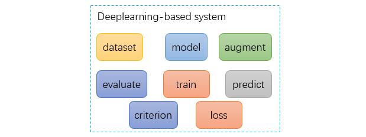

# Codelib
**Codelib** stores lots of code snippets, which is useful for building a deep-learning based system.

Forgive me for using Chinese.

### dataset
TODO

### augmentation
- 统一使用Compose组合所有的操作，方便使用。
- 同时提供train和test两种接口（因为像`RandomHorizontalFlip`这样的操作，在推断的时候，不需要使用）。
- 针对不同的问题，提供不同的接口操作。比如分类，可能只针对输入图像操作，目标检测还需要对2组坐标处理，显著性可能要定义各种groundtruth的形式。
- 所有的代码，均要通过测试。
- 每一类操作的接口，都必须相同。如果不同，有以下两种可能：
    - 它是其他类型的操作。
    - 它应该定义在`dataset`。

一个合理的写`augmentation`的流程是：
1. 针对具体的数据集形式，写`dataset`类，留好`transforms`和`target_transforms`接口。
2. 设计`transforms`和`target_transforms`分别要做的事情。
3. 在`augmentation.py`中写各个操作的接口定义。
4. 用`gen-test`生成测试脚本，写测试脚本。
5. 实现`augmentation.py`中的各个操作，并通过测试。

### model
- 网络的核心部分，从`nn.Module`派生。
- 负责如下事情：
    - 模型的定义
    - 模型参数初始化
    - 加载预训练参数（如有必要）
    - 分两种状态：train/test。具体来说，train状态下，网络的输出要方便loss的计算，网络的输出就是loss计算的输入。test状态下，网络的输出就是模型的预测结果。需要在网络的输出部分，区分两种状态。
    - 如果basenet使用预训练模型，basenet部分的定义参照`torchvision.models`的定义方法，这样可以方便加载预训练模型。

一个合理的写`model`的流程是：

TODO

### loss
TODO

### criterion
TODO

